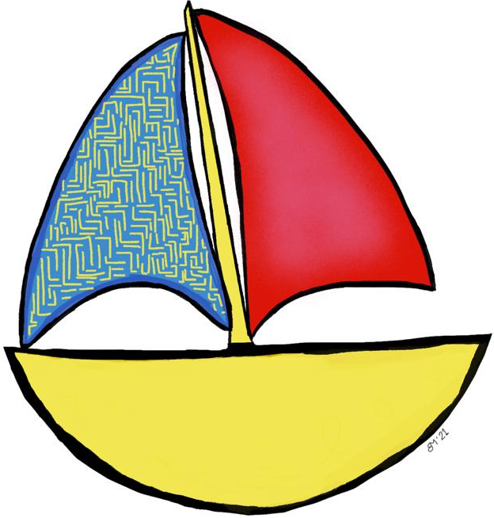

<p align="center">
    
</p>

# Navigo

This quick site template project allows you to quickly build minimal, responsive and static quick link pages.

**No more remembering and [navigating](https://www.online-latin-dictionary.com/latin-english-dictionary.php?parola=navigo) URLs.**

The page even uses a `manifest.json` for you to install it as Progressive-Web-App to your mobile phone home screen.

## How to build manually

### Setup

Prerequisite: Your python environment is Python 3.

Install dependencies via

```sh
pip install -r requirements.txt
```

### Single build

```sh
python build.py
```

Then the build will be placed in the dist folder

### Reloader

You can also execute
```sh
python watcher.py
```
to start a live reloader which will re-build the site every time you change any template, included static file or the `links.json`.

## Ci Build and CD

The master branch is built via the `build.yaml` workflow for GitHub pages.
If successful the build is available as GitHub pages deployment for the repo.

## Editing links

The quick link page is defined via the JSON file `links.json`.
The file follows this simple schema

```jsonc
{
    "title": "Navigo quick links",
    "short_name:": "Navigo",
    "description": "Quick navigation linking page",
    "background_color": "#333",
    "color": "#fff",
    "links": [
        {
            "name": "Navigo origin",
            "href": "https://www.online-latin-dictionary.com/latin-english-dictionary.php?parola=navigo",
            "iconUrl": "https://www.online-latin-dictionary.com/inc/logo-dictionary.gif"
        },
        {
            "name": "Navigo Project",
            "href": "https://github.com/DavidM42/navigo",
            "iconUrl": "/static/linkIcons/github120px.png"
        }
    ]
}
```

To edit the page & links edit `links.json`.

The `iconUrl` property is optional. The software tries to automatically retrieve the favicon if not given.
For some direct-URLs which don't strictly reference web pages it needs to be linked explicitly.

Build the page locally and check if an image was automatically retrieved. If not, think about adding a favicon to your links by linking a web address to get it from or adding a local path.
Also, you might want to supply bigger logo images if the automatically found ones look bad on big screens.

## Built files

Look in the `gh-pages` branch to see all files which are built by the build script `build.py`.

## GitHub Pages Custom Domains

Since this project is automatically deployable via GitHub pages you might want to use your custom (sub-)domain for this page.
For a detailed instruction on how to set this up [look here](https://docs.github.com/en/github/working-with-github-pages/managing-a-custom-domain-for-your-github-pages-site).

## Attribution

This project was originated from my quick link project for university [**wuel.de**](https://github.com/DavidM42/wuel).
I simplified the project for this template project and improved documentation.

The Navigo logo was drawn by a good friend of mine.
